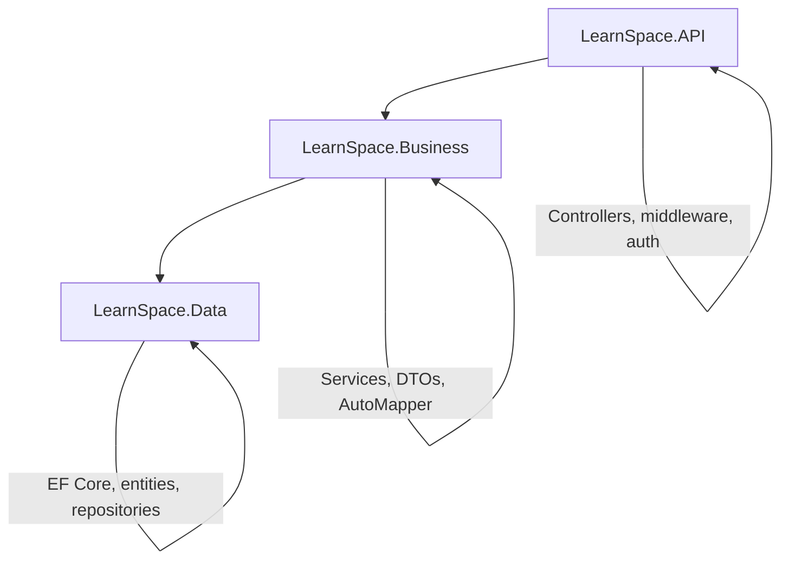

# LearnSpace

An ASP.NET Core Web API for managing online courses, lessons, quizzes, and student progress.

## Table of Contents

- [Features](#features)
- [Architecture](#architecture)
- [Tech Stack](#tech-stack)
- [Prerequisites](#prerequisites)
- [Getting Started](#getting-started)
- [Configuration](#configuration)
- [API Overview](#api-overview)
- [Project Structure](#project-structure)
- [Database](#database)

## Features

- **Authentication & Authorization** - JWT-based login/register with role-based access control (Admin, Staff, Instructor, Student, Guest).
- **Course Management** - Full CRUD for courses, modules, and lessons with YouTube video embedding.
- **Enrollments** - Students can enroll in courses; instructors manage their own.
- **Quiz Engine** - Multiple-answer quizzes with auto-grading, attempt tracking, and result analytics.
- **Progress Tracking** - Per-lesson completion status and time-spent recording.
- **Email Notifications** - SMTP-based password reset and account notifications.
- **Swagger UI** - Interactive API documentation at `/swagger`.
- **Infrastructure as Code** - PostgreSQL and pgAdmin provisioned via Docker Compose.

## Architecture

The solution follows an **N-Tier** pattern with strict separation of concerns:



Each layer depends only on the layer directly below it. Dependency injection wires everything together at startup.

## Tech Stack

| Layer       | Technology |
|-------------|-----------|
| Runtime     | .NET 10.0 |
| Framework   | ASP.NET Core Web API |
| ORM         | Entity Framework Core 10 |
| Database    | PostgreSQL 16 |
| Auth        | JWT Bearer tokens + BCrypt |
| Mapping     | AutoMapper 12 |
| Docs        | Swashbuckle / OpenAPI |
| Email       | SMTP (configurable) |
| Containers  | Docker Compose (PostgreSQL + pgAdmin) |

## Prerequisites

- [.NET 10.0 SDK](https://dotnet.microsoft.com/download/dotnet/10.0)
- [Docker](https://docs.docker.com/get-docker/) (for PostgreSQL and pgAdmin)

## Getting Started

### 1. Start PostgreSQL & pgAdmin

```bash
docker compose up -d
```

- PostgreSQL: `localhost:5432` (user: `postgres`, password: `postgres`, db: `learningplatform`)
- pgAdmin: `http://localhost:5050` (user: `admin@admin.com`, password: `admin`)

### 2. Apply database migrations

```bash
dotnet ef database update --project LearnSpace.Data/ --startup-project LearnSpace.API/
```

### 3. Run the API

```bash
dotnet run --project LearnSpace.API/
```

The API starts at `http://localhost:5255`. Swagger UI is available at `/swagger`.

### Quick health check

```bash
curl http://localhost:5255/health
# → "API is running"
```

## Configuration

All settings live in `LearnSpace.API/appsettings.json`:

| Section              | Purpose                          |
|----------------------|----------------------------------|
| `Jwt`                | Secret key, issuer, audience, token expiry |
| `passwordSettings`   | BCrypt salt rounds               |
| `ConnectionStrings`  | PostgreSQL connection string     |
| `Email`              | SMTP host, port, credentials     |

Override per-environment using `appsettings.Development.json` or environment variables.

## API Overview

| Group        | Base Path     | Auth Required |
|-------------|---------------|---------------|
| Auth        | `/auth`       | Mixed         |
| Courses     | `/courses`    | Mixed         |
| Modules     | `/modules`    | Instructor+   |
| Lessons     | `/lessons`    | Instructor+   |
| Enrollments | `/enrollments`| Authenticated |
| Quizzes     | `/quizzes`    | Mixed         |
| Users       | `/users`      | Authenticated |

### Roles

| Role        | Permissions |
|-------------|------------|
| **Admin**   | Full system access, role management |
| **Staff**   | Course and content management |
| **Instructor** | Manage own courses, modules, lessons, quizzes |
| **Student** | Enroll in courses, take quizzes, track progress |
| **Guest**   | View published courses (read-only) |

## Project Structure

```
LearnSpace/
├── LearnSpace.sln
├── docker-compose.yml
├── LearnSpace.API/
│   ├── Program.cs
│   ├── appsettings.json
│   └── Controllers/
│       ├── AuthController.cs
│       ├── CourseController.cs
│       ├── EnrollmentController.cs
│       ├── LessonController.cs
│       ├── ModuleController.cs
│       ├── QuizController.cs
│       └── UserController.cs
├── LearnSpace.Business/
│   ├── DTOs/
│   ├── Interfaces/
│   ├── Mappers/
│   ├── Services/
│   ├── Config/
│   └── Utils/
└── LearnSpace.Data/
    ├── Context/
    ├── Domain/
    │   ├── Entities/
    │   └── Enums/
    ├── Interfaces/
    ├── Migrations/
    └── Repositories/
```

## Database

Entity Framework Core manages the schema via code-first migrations. New migrations are created with:

```bash
dotnet ef migrations add <MigrationName> \
    --project LearnSpace.Data/ \
    --startup-project LearnSpace.API/
```

A schema diagram is available in [`DB_Schema.png`](./DB_Schema.png).
